## CICD 구축

<AWS EC2+RDS+DOCKER+GITACTIONS>

- EC2 = 배포를 위한 리눅스 기반 클라우드 환경 구축
- RDS = EC2가 꺼지면 데이터 베이스도 같이 꺼지는 것을 방지하기 위해서 데이터 베이스는 RDS로 구축
- DOCKER = 어느 환경에서 실행하던 똑같은 환경 구성을 위한 DOCKER 환경 세팅
- GITACTIONS = CICD 구축용

**배포 실행 환경 순서**

1. Docker Compose로 인프라(Kafka, Zookeeper, MongoDB) 실행
2. Spring Boot 애플리케이션 로컬 실행
3. AWS EC2 서버 생성
4. AWS RDS(MySQL) 생성 및 연결
5. EC2에 Docker 및 프로젝트 배포 환경 구성
6. GitHub Actions를 이용한 CI/CD 자동화
7. 배포 후 로그 / 상태 확인

---

기존 로컬환경에서는 환경변수로 했지만 배포환경에서는 .env 파일로 사용

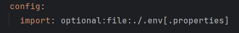
1.application.yml에서 .env 파일을 읽도록 수정

2..env 파일 생성

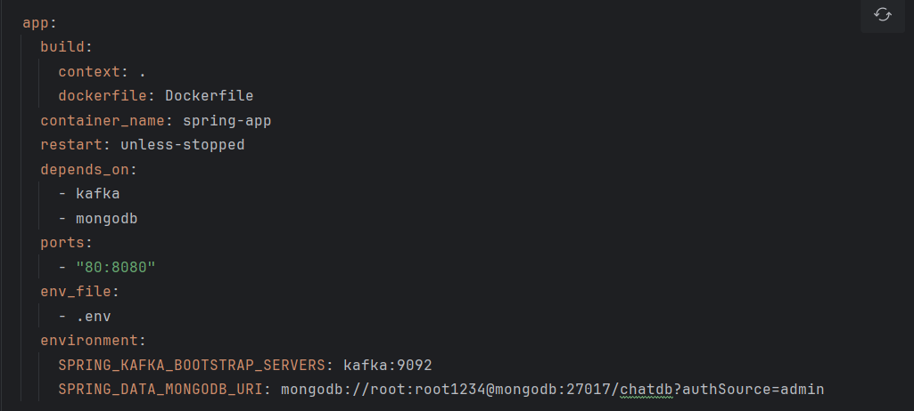
docker-compose.prod.yml의 일부

3.배포용 docker-compose.prod.yml 생성

- 여기서는 kafka , zookeeper , mongoDB를 포함해서 앱을 docker에서
  앱을 실행시키기 위한 앱빌드 까지 생성

---

## RDS 생성

1.aws-rds 구축(mysql)
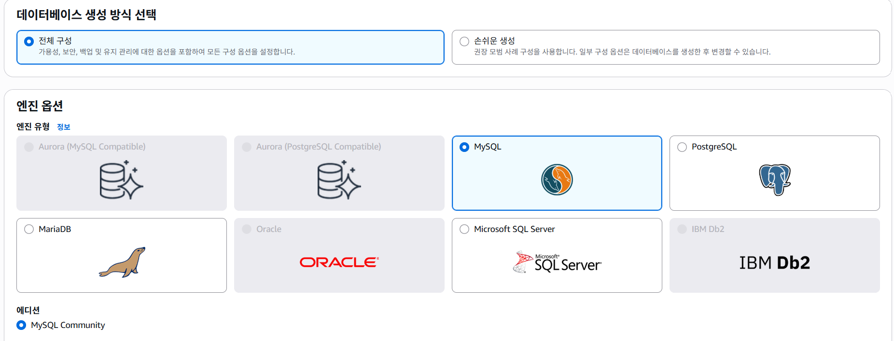
aws 데이터베이스 탭에서 mysql 선택

2.요금에 맞고 자기가 배포할 서버가 어떤 서버인지 파악후 가용영역을 알맞게 설정
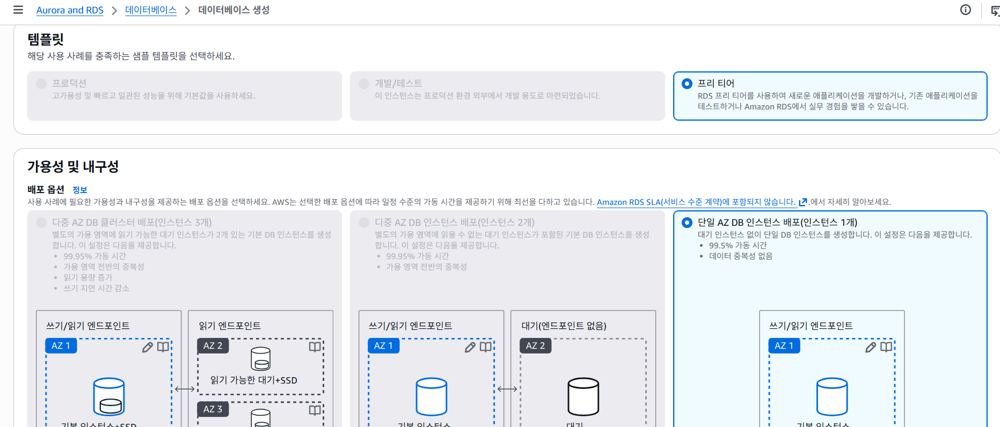

3.자체적으로 관리하려하기때문에 암호 설정
인증 옵션도 함께 설정
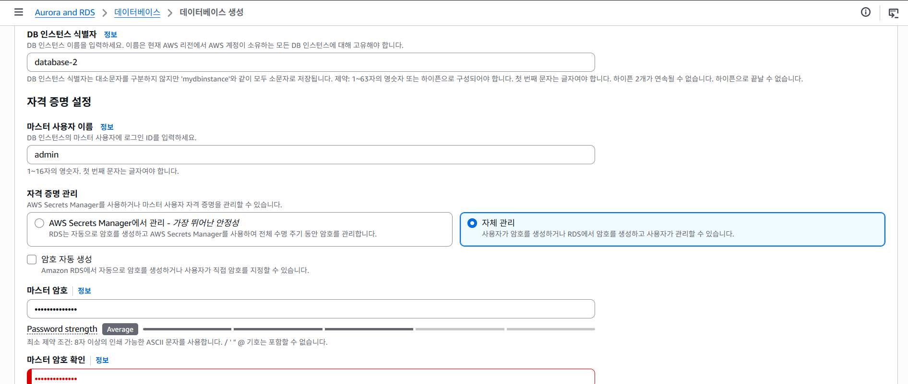

4.인스턴스 유형(요금제) , 스토리지도 사정에 맞게 알맞게 설정
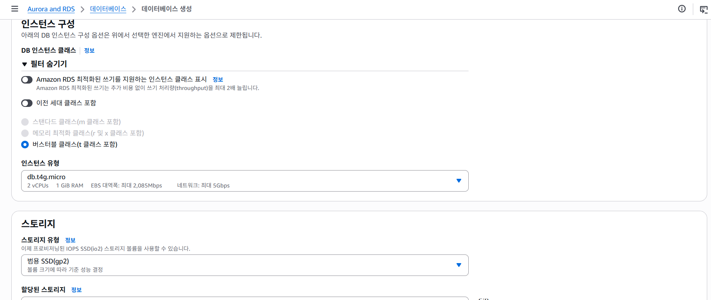

5.ec2연결을 하지않고 같은 가용역역의 vpc를 사용하여 연결을 하려고 함
퍼블릭 엑세스는 no
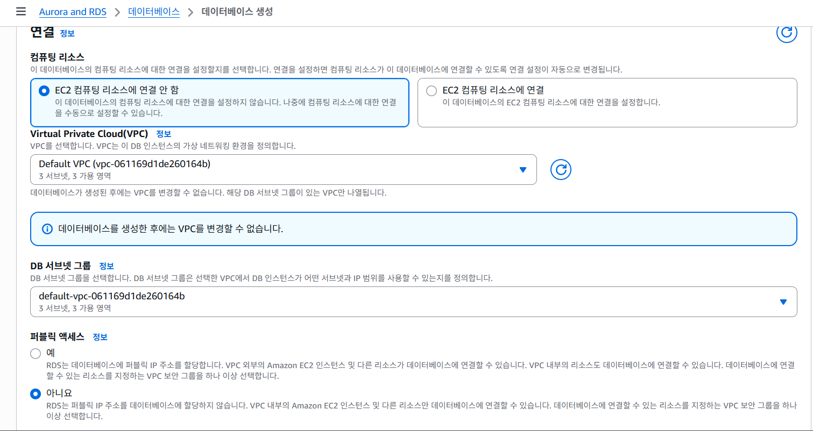

6.rds 생성완료

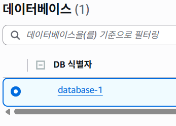

---

## EC2 생성

1.EC2 인스턴스 생성 ubuntu 사용
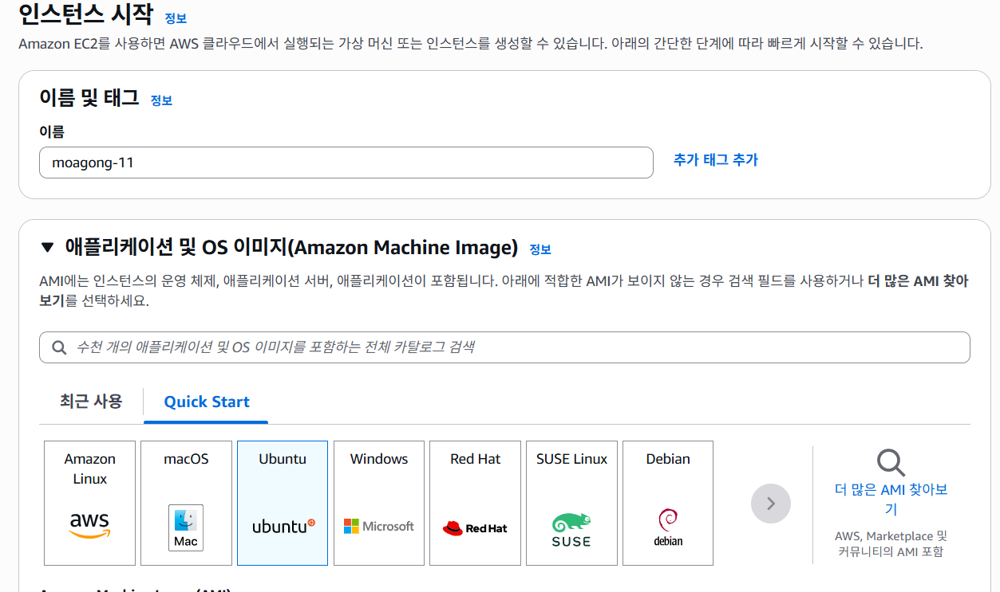

2.aws의 t3.micro는 용량이 작아 현재 서버에 있는
kafka를 띄우기 어렵다는 판단하에 c7i-flex.large인스턴스를 사용
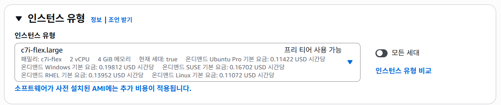

3.키페어 생성 (ssh)

4.rds vpc와 같은 보안그룹으로 생성
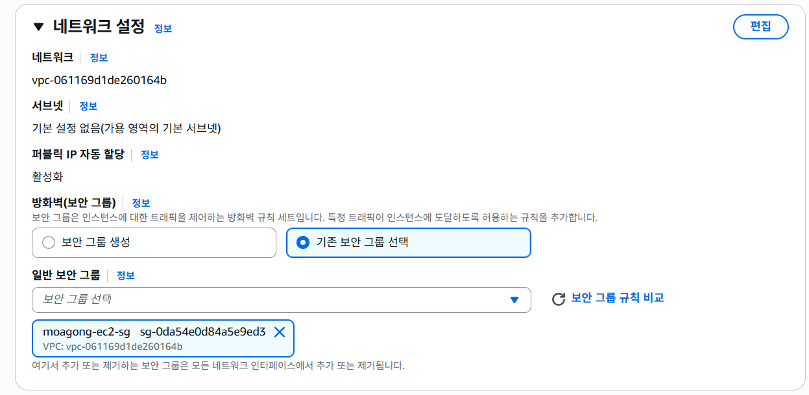

5.서버 상황에 맞는 스토리지 구성
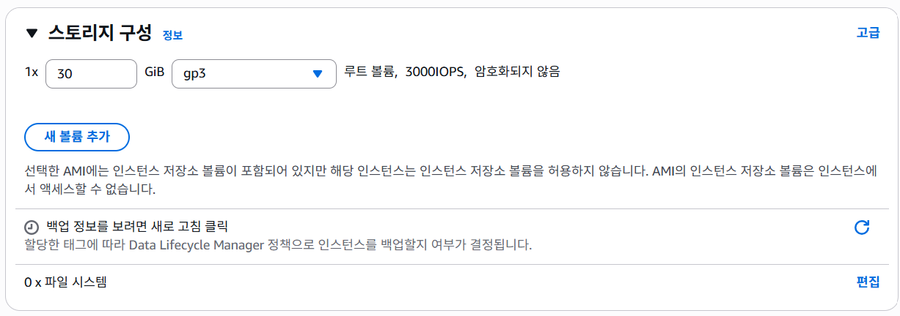

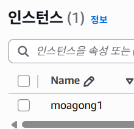

6.ec2인스턴스 생성완료

---

## EC2 환경 설정

1.EC2환경에 SSH키로 들어가준다.

2.패키지 목록 확인

3.깃 install 후 깃 버전 확인

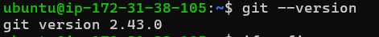

4.도커실행

5.도커시작

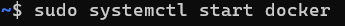
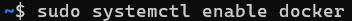

6.도커확인

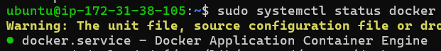
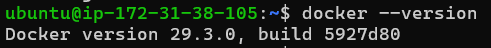

7.docker-compose 설치

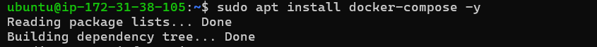
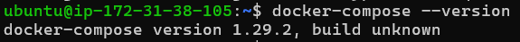

8.서버 리포지토리 clone

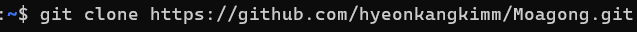

9.클론한 폴더에 들어가 권한 부여

10..env파일 구성

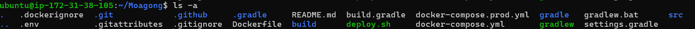

env파일안에 rds를 연결할때에는 rds안에서 데이터베이스를 생성해야함

11.dockerfile 생성

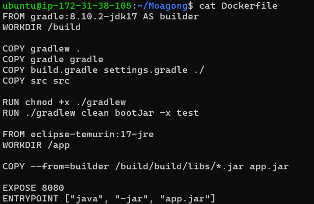

12..dockerignore 생성

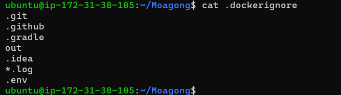

13.도커이미지컨테이너로 올림

14.도커실행확인

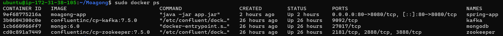

15.도커에서 실행되고있는 스프링앱 빌드 확인

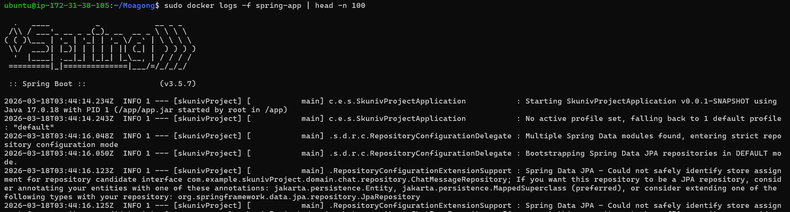
mysql , kafka도 같은 명령어로 확인 가능

16.해당퍼블릭아이피로 들어가서 작동 확인

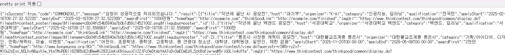

---

## CI/CD 파이프라인 구축

1.**.github/workflows/deploy.yml** 생성
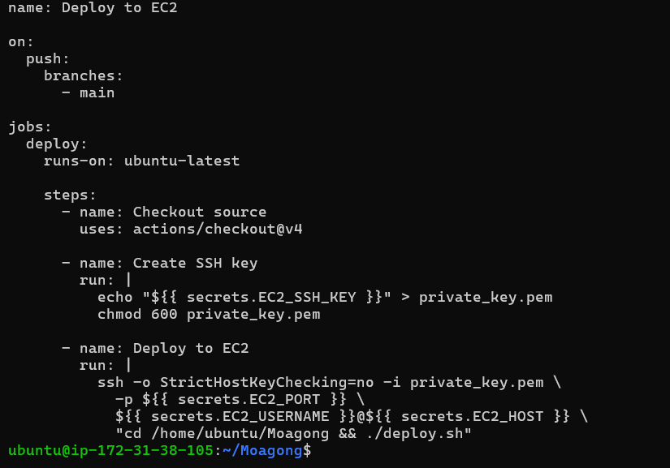

- 언제 배포할지 정의
- 어떤 브랜치에 push하면 실행할지 정의
- 어떤 서버에 접속할지 정의
- 서버가 무엇을 실행할지 정의

2.배포스크립트 작성

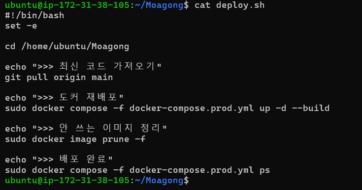

3.Repository → Settings → Secrets and variables → Actions
에서 토큰 작성
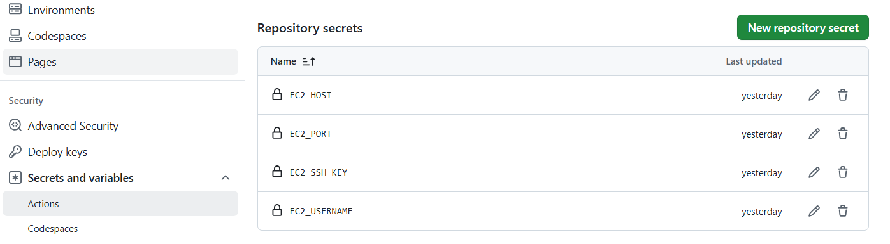

4.재배포

**sudo docker compose -f docker-compose.prod.yml up -d --build**

5.테스트
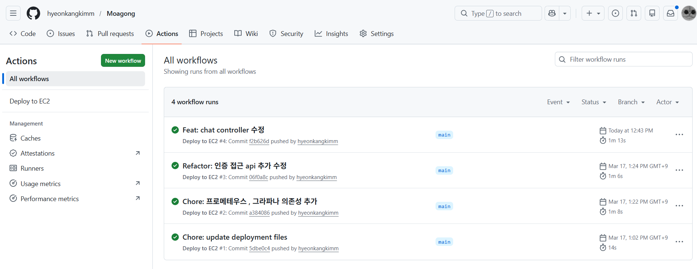
main으로 merge하면 재빌드를 해 코드가 제대로 들어가는 것을 확인 할 수 있다.

**ci/cd 파이프라인 구축 성공**

---

## 배포된 환경에서 프로메테우스 그라파나 모니터링 테스트

1.prometheus.yml 생성

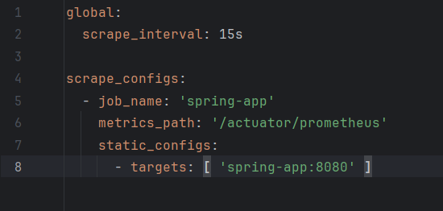

2.securityConfig 파일에서 접근 권한 수정

**/actuator/ 허용**

3.gradle 추가

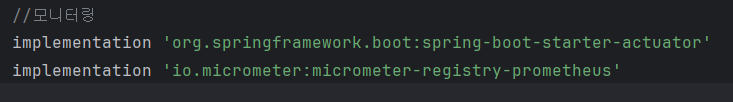

4.application.yml 수정

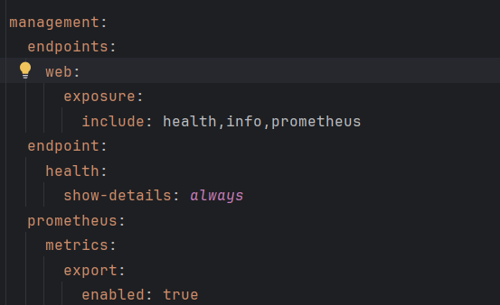

5.docker-compose.prod.yml 수정

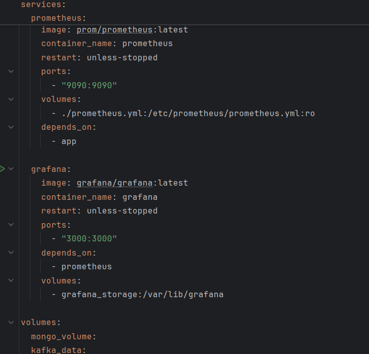

6.인바운드 규칙 편집

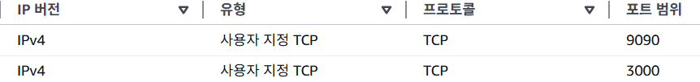

7.main git push후 ci/cd

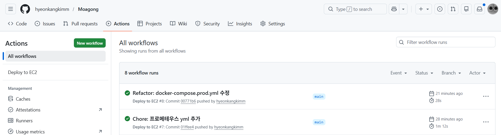

8.프로메테우스 확인
(퍼블릭 아이피로 들어간 후 상태값 확인)

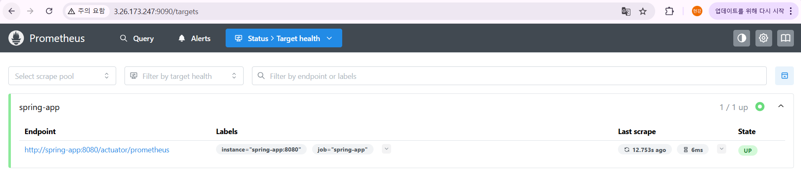
정상

9.그라파나 대시보드 확인

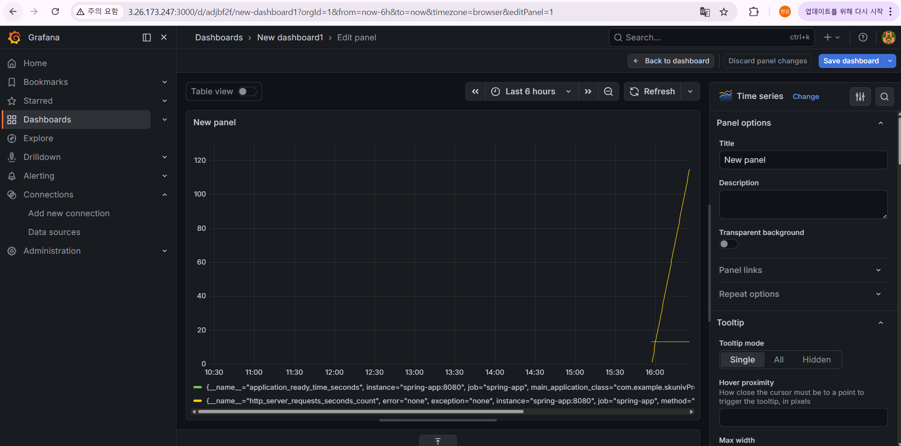
정상

**이로써 배포 ,ci/cd , 모니터링 환경까지 구축완료**